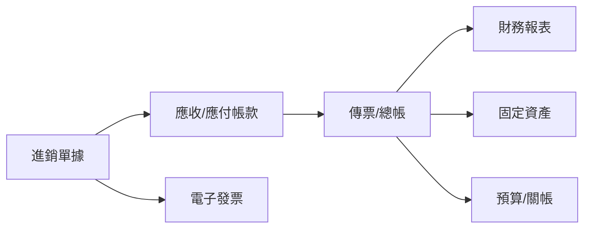

# Fin8d 財務系統規劃

> 本文件依據 **CERP（Winton CloudERP）** 官方文件分析整理，作為 Fin8d 財務系統的開發藍圖。

## CERP 財務系統核心洞察

CERP 的財務並非孤立運作，而是與進銷、發票、固資、簽核等模組串接：



### 關鍵設計原則（參考 CERP）

- **傳票產生流程**：`進銷 → 帳款 → 總帳`（或簡化版 `進銷 → 總帳`）
- **會計項目**需支援：統制/明細、立沖帳、稅額、對象、部門、專案、調匯
- **關帳機制**：凍結日期、發票申報期間鎖定、預算控管
- **台灣在地需求**：電子發票 MIG 4.1、Turnkey、進銷項申報、多幣別匯兌

---

## Fin8d 開發規劃（分 4 階段）

### Phase 1 — 財務核心（MVP）

先建立可獨立運作的會計底層：

| 模組 | 功能 |
|------|------|
| 主檔 | 會計科目、幣別/匯率、公司銀行、部門、客戶/廠商 |
| 總帳 | 傳票維護、借貸平衡、審核、傳票類別 |
| 報表 | 試算表、資產負債表、損益表、科目餘額 |
| 系統 | 使用者權限、共用參數、關帳/凍結日期 |

**里程碑**：可手動登打傳票、產出三大報表、完成月結關帳。

---

### Phase 2 — 帳款與收付款

對接日常營運金流：

| 模組 | 功能 |
|------|------|
| 應收 | 應收憑單、收款沖銷、帳齡分析 |
| 應付 | 應付憑單、付款沖銷、請款流程（可選） |
| 票據 | 應收/應付票據、兌現 |
| 銀行 | 批次收付、匯兌損益 |

**里程碑**：帳款立帳 → 收付款沖銷 → 自動產生傳票。

---

### Phase 3 — 業務整合

讓財務資料從業務單據自動流入（CERP 的核心價值）：

```
銷貨/進貨單 → 應收/應付憑單 → 立帳傳票
     ↓
  電子發票開立/進項登錄
```

| 模組 | 功能 |
|------|------|
| 銷售 | 訂單、銷貨、銷退、銷折 |
| 採購 | 進貨、進退、進折 |
| 發票 | 字軌管理、銷項/進項發票、XML 上傳 |
| 期末 | 調匯、存貨盤點/銷貨成本認列 |

**里程碑**：一張銷貨單自動產生帳款、傳票與發票。

---

### Phase 4 — 進階與合規

| 模組 | 功能 |
|------|------|
| 固定資產 | 取得、折舊、報廢、年度結轉 |
| 預算 | 預算維護、超支檢核 |
| 簽核 | 傳票/請款/付款電子簽核流程 |
| 分析 | 財務比例分析、現金流量表、管理報表 |

---

## 技術架構建議

```
┌─────────────────────────────────────┐
│  Frontend（Web UI）                  │
├─────────────────────────────────────┤
│  API Layer（REST / GraphQL）         │
├──────────┬──────────┬───────────────┤
│ 總帳引擎  │ 帳款引擎  │ 單據/工作流引擎 │
├──────────┴──────────┴───────────────┤
│  PostgreSQL（交易資料 + 會計分錄）     │
└─────────────────────────────────────┘
```

### 核心資料模型（最少需求）

- `accounts` — 會計科目樹
- `vouchers` + `voucher_lines` — 傳票分錄
- `ar_invoices` / `ap_invoices` — 應收/應付
- `payments` + `payment_allocations` — 收付款沖銷
- `fiscal_periods` — 會計期間與關帳狀態

---

## 建議優先順序

若資源有限，建議依下列順序推進：

1. **Phase 1 先做** — 沒有穩固總帳，後續模組難以正確串接
2. **Phase 2 緊接** — 帳款是中小企業最常見的痛點
3. **發票可於 Phase 2.5 插入** — 台灣合規需求高，但可先做簡化版「發票登錄」
4. **進銷整合放 Phase 3** — 若暫無 ERP 需求，可先以手動立帳替代

---

## 與 CERP 的差異化方向

CERP 為成熟商用 ERP，Fin8d 若自研可聚焦：

- 更現代的 UI/UX（CERP 偏傳統表單式操作）
- API-first 設計，方便與電商、POS 等外部系統整合
- 模組化訂閱，依需求啟用功能
- 雲端原生部署，降低維運成本

---

## 下一步

建議從 **Phase 1 的資料模型與傳票 API** 開始實作。

需先決定產品定位：

- **純記帳系統**：聚焦 Phase 1 + Phase 2
- **完整 ERP**：需納入 Phase 3 的進銷與發票整合

兩者 Phase 1 的範圍相近，但 Phase 3 之後的複雜度差異顯著。

---

## 參考資料

- [CERP 雲端管理布政使 II 官方文件](https://cerp.gitbook.io/winton-clouderp)
- 會計總帳、帳款管理、發票管理、固定資產等模組說明
