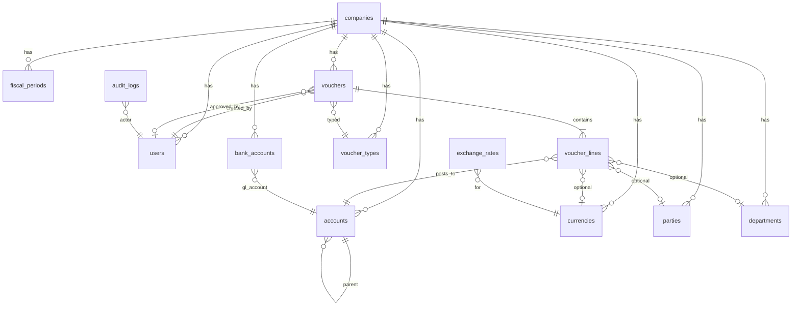

# Fin8d 資料模型（Phase 1）

**版本**：1.0  
**資料庫**：PostgreSQL `fin8d_dev`

---

## 1. ER 概覽



---

## 2. 核心資料表

### companies

| 欄位 | 類型 | 說明 |
|------|------|------|
| id | UUID PK | |
| name | VARCHAR(200) | 公司名稱 |
| tax_id | VARCHAR(20) | 統一編號 |
| fiscal_year_start_month | SMALLINT | 會計年度起始月（1–12） |
| base_currency_code | CHAR(3) | 本位幣，預設 TWD |
| created_at | TIMESTAMPTZ | |
| updated_at | TIMESTAMPTZ | |

### users

| 欄位 | 類型 | 說明 |
|------|------|------|
| id | UUID PK | |
| company_id | UUID FK | |
| email | VARCHAR(255) UNIQUE | |
| password_hash | VARCHAR(255) | bcrypt |
| display_name | VARCHAR(100) | |
| role | VARCHAR(50) | admin / finance_manager / accountant / viewer |
| is_active | BOOLEAN | |
| last_login_at | TIMESTAMPTZ | |
| created_at | TIMESTAMPTZ | |

### fiscal_periods

| 欄位 | 類型 | 說明 |
|------|------|------|
| id | UUID PK | |
| company_id | UUID FK | |
| year | SMALLINT | 會計年度 |
| period | SMALLINT | 1–12 |
| start_date | DATE | |
| end_date | DATE | |
| status | VARCHAR(20) | open / closed |
| closed_at | TIMESTAMPTZ | |
| closed_by | UUID FK users | |

### accounts（會計科目）

| 欄位 | 類型 | 說明 |
|------|------|------|
| id | UUID PK | |
| company_id | UUID FK | |
| parent_id | UUID FK self | 上層科目 |
| code | VARCHAR(20) | 科目代碼 |
| name | VARCHAR(200) | 科目名稱 |
| account_type | VARCHAR(20) | asset / liability / equity / revenue / expense |
| is_control | BOOLEAN | 統制科目 |
| is_postable | BOOLEAN | 可過帳 |
| level | SMALLINT | 1–4 |
| is_active | BOOLEAN | |
| sort_order | INT | |

**索引**：`(company_id, code)` UNIQUE

### currencies / exchange_rates

**currencies**

| 欄位 | 類型 | 說明 |
|------|------|------|
| id | UUID PK | |
| company_id | UUID FK | |
| code | CHAR(3) | ISO 4217 |
| name | VARCHAR(50) | |
| decimal_places | SMALLINT | 預設 2 |

**exchange_rates**

| 欄位 | 類型 | 說明 |
|------|------|------|
| id | UUID PK | |
| company_id | UUID FK | |
| currency_id | UUID FK | |
| rate_date | DATE | |
| rate | NUMERIC(18,6) | 對本位幣 |
| source | VARCHAR(50) | manual / import |

### parties（客戶/廠商）

| 欄位 | 類型 | 說明 |
|------|------|------|
| id | UUID PK | |
| company_id | UUID FK | |
| party_type | VARCHAR(20) | customer / vendor / both |
| code | VARCHAR(30) | |
| name | VARCHAR(200) | |
| tax_id | VARCHAR(20) | |
| contact_name | VARCHAR(100) | |
| email | VARCHAR(255) | |
| phone | VARCHAR(50) | |
| is_active | BOOLEAN | |

### departments

| 欄位 | 類型 | 說明 |
|------|------|------|
| id | UUID PK | |
| company_id | UUID FK | |
| parent_id | UUID FK self | |
| code | VARCHAR(20) | |
| name | VARCHAR(100) | |
| is_active | BOOLEAN | |

### bank_accounts

| 欄位 | 類型 | 說明 |
|------|------|------|
| id | UUID PK | |
| company_id | UUID FK | |
| account_id | UUID FK accounts | 對應 GL 科目 |
| bank_name | VARCHAR(100) | |
| account_number | VARCHAR(50) | |
| account_name | VARCHAR(100) | |
| currency_id | UUID FK | |
| is_active | BOOLEAN | |

### voucher_types

| 欄位 | 類型 | 說明 |
|------|------|------|
| id | UUID PK | |
| company_id | UUID FK | |
| code | VARCHAR(20) | general / adjusting / closing |
| name | VARCHAR(50) | |
| prefix | VARCHAR(10) | 編號前綴 |

### vouchers

| 欄位 | 類型 | 說明 |
|------|------|------|
| id | UUID PK | |
| company_id | UUID FK | |
| voucher_no | VARCHAR(30) UNIQUE | V202609-00001 |
| voucher_type_id | UUID FK | |
| voucher_date | DATE | 傳票日期 |
| fiscal_period_id | UUID FK | |
| description | TEXT | 整張摘要 |
| status | VARCHAR(20) | draft / pending / approved / void |
| total_debit | NUMERIC(18,2) | |
| total_credit | NUMERIC(18,2) | |
| created_by | UUID FK users | |
| approved_by | UUID FK users | |
| approved_at | TIMESTAMPTZ | |
| voided_at | TIMESTAMPTZ | |
| created_at | TIMESTAMPTZ | |
| updated_at | TIMESTAMPTZ | |

### voucher_lines

| 欄位 | 類型 | 說明 |
|------|------|------|
| id | UUID PK | |
| voucher_id | UUID FK | |
| line_no | SMALLINT | 行號 |
| account_id | UUID FK | |
| debit | NUMERIC(18,2) | 借方 |
| credit | NUMERIC(18,2) | 貸方 |
| description | VARCHAR(500) | 行摘要 |
| department_id | UUID FK | 可空 |
| party_id | UUID FK | 可空 |
| currency_id | UUID FK | 可空 |
| exchange_rate | NUMERIC(18,6) | 可空 |
| foreign_amount | NUMERIC(18,2) | 原幣金額 |

**約束**：`(debit = 0 AND credit > 0) OR (credit = 0 AND debit > 0)`

### audit_logs

| 欄位 | 類型 | 說明 |
|------|------|------|
| id | UUID PK | |
| company_id | UUID FK | |
| user_id | UUID FK | |
| action | VARCHAR(50) | voucher.create / period.close |
| entity_type | VARCHAR(50) | voucher / fiscal_period |
| entity_id | UUID | |
| payload | JSONB | 變更快照 |
| created_at | TIMESTAMPTZ | |

---

## 3. 預設種子資料

### 會計科目範本（台灣常用）

```
1     資產
  11    流動資產
    1101  現金
    1102  銀行存款
    1141  應收帳款
  12    固定資產
    1201  設備
2     負債
  21    流動負債
    2101  應付帳款
3     權益
  3101  股本
  3201  保留盈餘
4     收入
  4101  銷貨收入
5     費用
  5101  薪資費用
  5201  租金費用
```

---

## 4. Migration 策略

1. `001_init_schema.sql` — 建表
2. `002_seed_company_and_roles.sql` — 預設公司、admin
3. `003_seed_chart_of_accounts.sql` — 科目範本
4. `004_seed_fiscal_periods.sql` — 當年度 12 期
