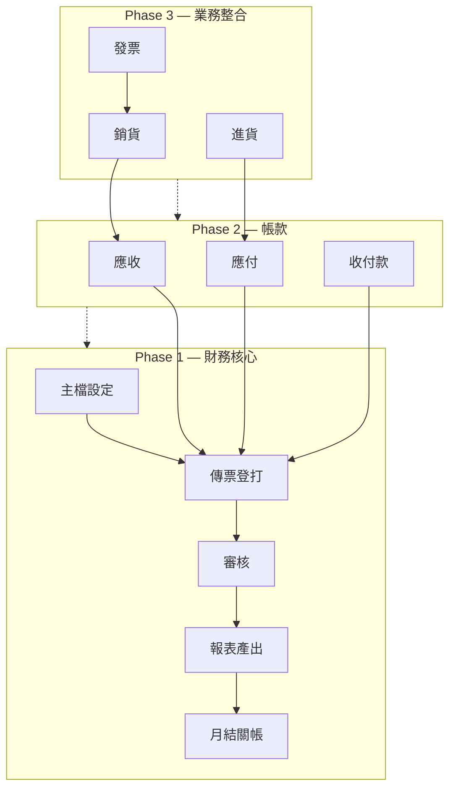
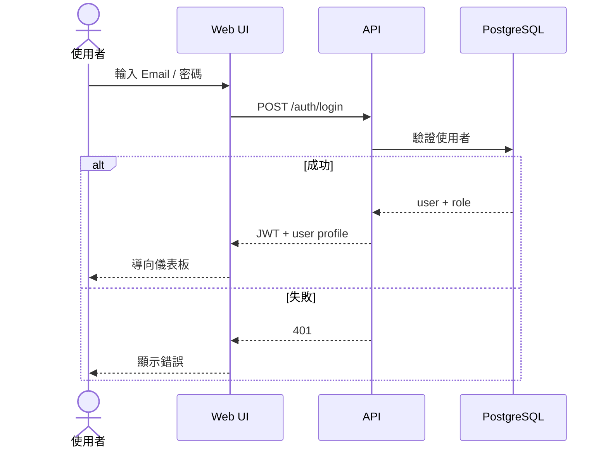
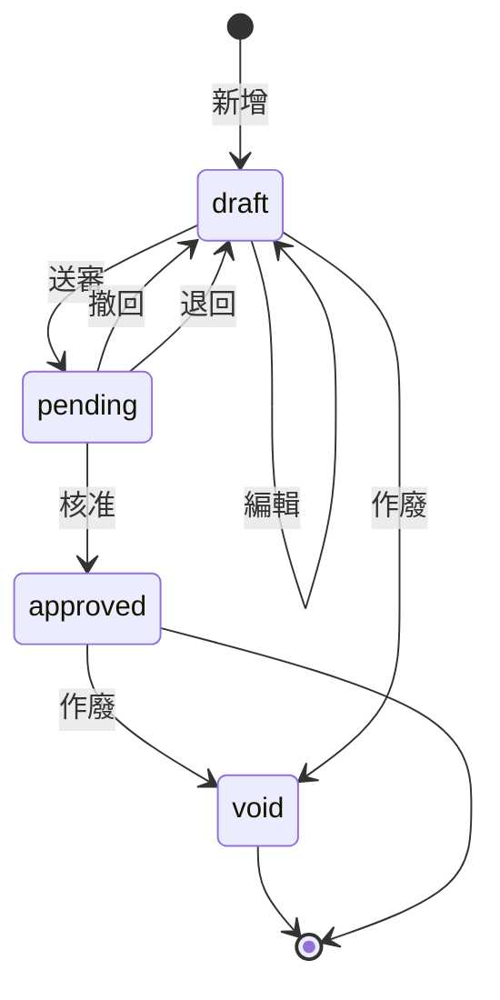
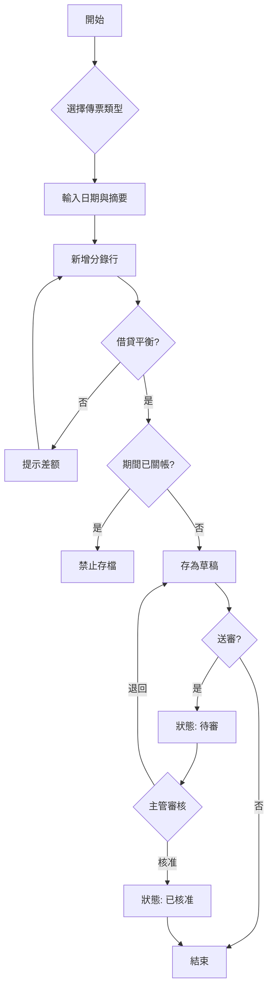
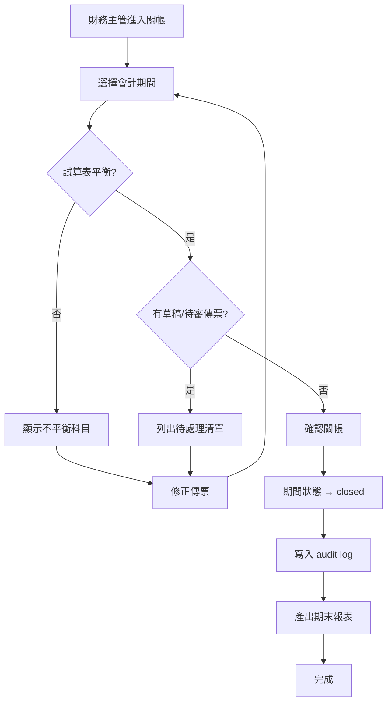
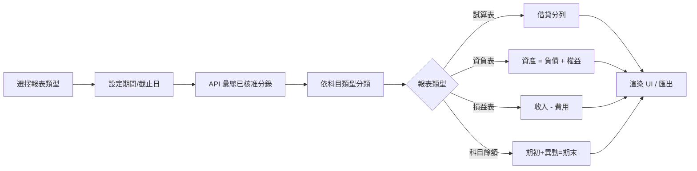
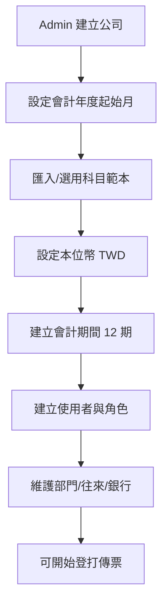
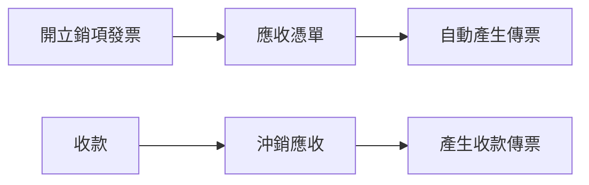

# Fin8d 業務流程

**版本**：1.0

---

## 1. 系統總覽流程

---

## 2. 使用者登入流程

---

## 3. 傳票生命週期

### 傳票登打詳細流程

---

## 4. 月結關帳流程

---

## 5. 報表產出流程

---

## 6. 主檔初始化流程（新客戶 Onboarding）

---

## 7. Phase 2 預覽 — 應收立帳（參考）

Phase 1 不包含，供後續擴展對照。
