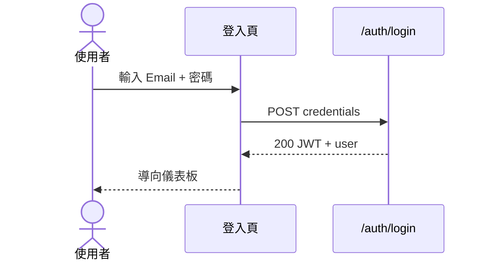

# AUTH — 認證模組流程

---

## FL-AUTH-01 登入

| 項目 | 內容 |
|------|------|
| 角色 | 所有使用者 |
| 前置條件 | 帳號已建立且 `is_active=true` |
| Mockup（正） | [login.html](../../mockup/login.html) |
| Mockup（反） | [login-error.html](../../mockup/login-error.html) |

### 正向流程

| 步驟 | 動作 | 系統行為 |
|------|------|----------|
| 1 | 輸入有效 Email、密碼 | 前端格式驗證通過 |
| 2 | 點擊「登入」 | POST `/auth/login` |
| 3 | — | 驗證 bcrypt 密碼 |
| 4 | — | 回傳 JWT，寫入 HttpOnly Cookie |
| 5 | — | 導向 `/dashboard` |

### 反向流程

| 編號 | 情境 | 觸發條件 | 系統回應 | UI 呈現 |
|------|------|----------|----------|---------|
| N1 | 帳密錯誤 | 密碼不符 | 401 `INVALID_CREDENTIALS` | 欄位下方紅字「Email 或密碼錯誤」 |
| N2 | 帳號不存在 | Email 未註冊 | 401（同 N1，不洩漏存在性） | 同上 |
| N3 | 帳號停用 | `is_active=false` | 403 `ACCOUNT_DISABLED` | 「此帳號已停用，請聯絡管理員」 |
| N4 | 格式錯誤 | Email 格式無效 | 前端阻擋 | 「請輸入有效 Email」 |
| N5 | 連續失敗 | 5 次 / 15 分鐘 | 429 `TOO_MANY_ATTEMPTS` | 「登入嘗試過多，請 15 分鐘後再試」 |
| N6 | Session 已存在 | 已登入再訪登入頁 | 302 | 直接導向儀表板 |

---

## FL-AUTH-02 登出

| Mockup | [dashboard.html](../../mockup/dashboard.html) |

### 正向

| 步驟 | 動作 | 系統行為 |
|------|------|----------|
| 1 | 點擊使用者選單 → 登出 | POST `/auth/logout` |
| 2 | — | 清除 Session / Cookie |
| 3 | — | 導向 `/login` |

### 反向

| 編號 | 情境 | 系統回應 |
|------|------|----------|
| N1 | Token 已過期 | 仍清除本地 Cookie，導向登入頁 |
| N2 | 未登入呼叫 logout | 204，導向登入頁 |

---

## FL-AUTH-03 密碼重設

| Mockup（正） | [password-reset-request.html](../../mockup/password-reset-request.html) |
| Mockup（反） | [password-reset-error.html](../../mockup/password-reset-error.html) |

### 正向 — 請求重設

| 步驟 | 動作 | 系統行為 |
|------|------|----------|
| 1 | 登入頁點「忘記密碼」 | 開啟重設頁 |
| 2 | 輸入 Email，送出 | POST `/auth/forgot-password` |
| 3 | — | 寄送含一次性 token 連結（30 分鐘有效） |
| 4 | — | 顯示「若 Email 存在，已寄出重設信」（防枚舉） |

### 正向 — 設定新密碼

| 步驟 | 動作 | 系統行為 |
|------|------|----------|
| 1 | 點 Email 連結 | 驗證 token |
| 2 | 輸入新密碼 ×2 | 前端強度檢查 |
| 3 | 送出 | POST `/auth/reset-password` |
| 4 | — | 更新 hash，作廢 token |
| 5 | — | 導向登入頁 + 成功 Toast |

### 反向

| 編號 | 情境 | 系統回應 | UI |
|------|------|----------|-----|
| N1 | Token 過期 | 400 `TOKEN_EXPIRED` | 「連結已失效，請重新申請」 |
| N2 | Token 已使用 | 400 `TOKEN_USED` | 同上 |
| N3 | 密碼太短 | 400 `WEAK_PASSWORD` | 「至少 8 字元，含英數」 |
| N4 | 兩次密碼不一致 | 前端驗證 | 欄位提示 |
| N5 | Email 格式錯誤 | 前端驗證 | 欄位提示 |

---

## FL-AUTH-04 Session 逾時

### 正向（自動续期 — 可選 Phase 1.1）

使用者操作時刷新 token 過期時間。

### 反向

| 編號 | 情境 | 系統回應 | UI |
|------|------|----------|-----|
| N1 | 閒置 > 8 小時 | 401 | Modal「Session 已過期，請重新登入」→ 登入頁 |
| N2 | API 請求時 token 無效 | 401 | 全域 interceptor 導向登入 |
| N3 | 登入後 URL 帶 redirect | 登入成功 | 導回原請求頁 |

---

## FL-AUTH-05 權限不足（跨模組共用）

| Mockup | [access-denied.html](../../mockup/access-denied.html) |

| 編號 | 情境 | 系統回應 | UI |
|------|------|----------|-----|
| N1 | viewer 嘗試新增傳票 | 403 `FORBIDDEN` | 403 頁或 Toast |
| N2 | accountant 嘗試核准 | 403 | 「您沒有核准權限」 |
| N3 | 直接 URL 存取無權頁 | 403 | 專用 403 頁 + 返回連結 |

---

## FL-AUTH-06 取得當前使用者

### 正向

GET `/auth/me` → 回傳 profile + role，用於側邊欄與按鈕顯示。

### 反向

| 編號 | 情境 | 回應 |
|------|------|------|
| N1 | 未帶 token | 401 |
| N2 | 帳號已停用 | 403，強制登出 |
