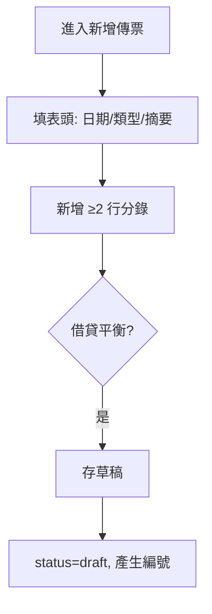

# GL — 總帳 / 傳票模組流程

---

## FL-GL-01 新增傳票（草稿）

| Mockup（正） | [voucher-entry.html](../../mockup/voucher-entry.html) |
| Mockup（反-不平衡） | [voucher-entry-unbalanced.html](../../mockup/voucher-entry-unbalanced.html) |
| Mockup（反-關帳） | [voucher-entry-closed-period.html](../../mockup/voucher-entry-closed-period.html) |

### 正向

| 步驟 | 驗證 | API |
|------|------|-----|
| 1 | 日期在開放會計期間 | — |
| 2 | 每行僅借或僅貸 | — |
| 3 | 科目 `is_postable=true` | — |
| 4 | Σ借 = Σ貸 | POST `/vouchers` |

### 反向

| 編號 | 情境 | 回應 | UI |
|------|------|------|-----|
| N1 | 借貸不平衡 | 422 `UNBALANCED` | 送審 disabled，紅字差额 |
| N2 | 僅 1 行分錄 | 422 | 「至少需要 2 行分錄」 |
| N3 | 選統制科目 | 422 | 「此科目不可過帳」 |
| N4 | 期間已關帳 | 409 `PERIOD_CLOSED` | 頂部 Banner + 禁止存檔 |
| N5 | 金額 ≤ 0 | 422 | 欄位提示 |
| N6 | 日期在未来 | 422 | 「傳票日期不可晚於今天」 |
| N7 | 無編輯權限 | 403 | 403 頁 |

---

## FL-GL-02 編輯草稿傳票

| Mockup | [voucher-entry.html](../../mockup/voucher-entry.html) |

### 正向

僅 `status=draft` 可 PATCH；版本不衝突。

### 反向

| 編號 | 情境 | 回應 |
|------|------|------|
| N1 | 編輯 pending/approved | 409 `INVALID_STATUS` |
| N2 | 他人草稿（Phase 1 允許同角色編輯） | — |
| N3 | 樂觀鎖衝突 | 409 `VERSION_CONFLICT`「資料已被修改，請重新載入」 |

---

## FL-GL-03 送審

| Mockup | [voucher-entry.html](../../mockup/voucher-entry.html) |

### 正向

draft → pending；鎖定編輯。

### 反向

| 編號 | 情境 | 回應 |
|------|------|------|
| N1 | 不平衡送審 | 422 |
| N2 | 必填摘要空白 | 422 |
| N3 | 關帳期間 | 409 |

---

## FL-GL-04 核准傳票

| Mockup（正） | [voucher-approve.html](../../mockup/voucher-approve.html) |
| Mockup（反） | [voucher-approve-blocked.html](../../mockup/voucher-approve-blocked.html) |

### 正向

| 步驟 | 角色 | 結果 |
|------|------|------|
| 1 | finance_manager / admin | 開啟待審詳情 |
| 2 | 點核准 | POST `/vouchers/:id/approve` |
| 3 | — | status=approved，寫 audit log |

### 反向

| 編號 | 情境 | 回應 |
|------|------|------|
| N1 | accountant 核准 | 403 |
| N2 | 非 pending 狀態 | 409 |
| N3 | 自己送審自己核准（可配置） | 422「不可核准自己的傳票」 |
| N4 | 核准後試算表將不平衡（關帳檢查用） | 422 |

---

## FL-GL-05 退回傳票

| Mockup | [voucher-approve.html](../../mockup/voucher-approve.html) |

### 正向

pending → draft；必填退回原因。

### 反向

| 編號 | 情境 | 回應 |
|------|------|------|
| N1 | 未填原因 | 400 |
| N2 | 非 pending | 409 |

---

## FL-GL-06 撤回送審

### 正向

建立者於 pending 時撤回 → draft。

### 反向

| 編號 | 情境 | 回應 |
|------|------|------|
| N1 | 主管已開啟審核中（可選鎖） | 409 |
| N2 | 已 approved | 409 |

---

## FL-GL-07 作廢傳票

| Mockup | [voucher-detail-void.html](../../mockup/voucher-detail-void.html) |

### 正向

draft / pending → void（Phase 1）；approved 需 admin 特權或沖銷傳票（Phase 1.1）。

### 反向

| 編號 | 情境 | 回應 |
|------|------|------|
| N1 | 已關帳期間 | 409 |
| N2 | 已 void | 409 |

---

## FL-GL-08 複製傳票

### 正向

POST `/vouchers/:id/copy` → 新 draft，新編號、今日日期。

### 反向

| 編號 | 情境 | 回應 |
|------|------|------|
| N1 | 來源含停用科目 | 422 列出停用科目 |
| N2 | 來源 void | 404/422 |

---

## FL-GL-09 查詢傳票列表

| Mockup | [vouchers-list.html](../../mockup/vouchers-list.html) |

### 正向

多條件篩選、分頁、排序。

### 反向

| 編號 | 情境 | 回應 |
|------|------|------|
| N1 | date_from > date_to | 400 |
| N2 | 無資料 | 空狀態插圖 |

---

## FL-GL-10 檢視傳票詳情

| Mockup（正） | [voucher-detail.html](../../mockup/voucher-detail.html) |
| Mockup（唯讀） | [voucher-detail-approved.html](../../mockup/voucher-detail-approved.html) |

### 反向

| N1 | 不存在 | 404 |
| N2 | viewer 看草稿（可隱藏未核准） | 403 或過濾 |

---

## FL-GL-11 多幣別分錄（Phase 1 選配）

### 正向

輸入原幣 + 匯率 → 自動計算本位幣借貸。

### 反向

| N1 | 無該日匯率 | 422「請先建立匯率」 |
| N2 | 匯率 × 原幣 ≠ 本位幣（四捨五入規則） | 422 |

---

## FL-GL-12 批次核准（Phase 1 選配）

| Mockup | [vouchers-list.html](../../mockup/vouchers-list.html) |

### 正向

勾選多張 pending → 批次 approve。

### 反向

| N1 | 含非 pending | 部分失敗 207 |
| N2 | 超過 50 張 | 422 |
