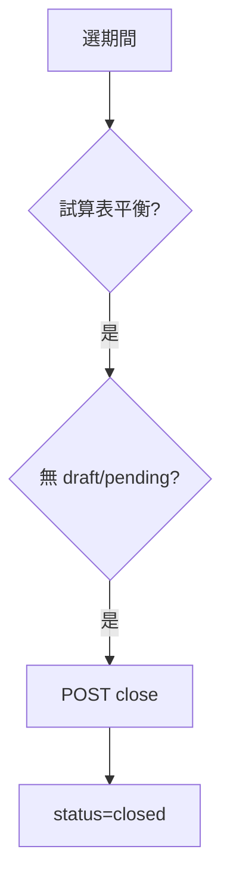

# SYS — 系統管理模組流程

---

## FL-SYS-01 公司基本資料維護

| Mockup | [settings.html](../../mockup/settings.html) |

### 正向

PATCH `/company` — 名稱、統編、會計年度起始月。

### 反向

| N1 | 統編格式錯 | 422 |
| N2 | 非 admin/manager | 403 |
| N3 | 改會計年度起始月且已有期間 | 422「請聯絡支援」 |

---

## FL-SYS-02 使用者 CRUD

| Mockup（正） | [settings.html](../../mockup/settings.html) |
| Mockup（表單） | [user-form.html](../../mockup/user-form.html) |

### 正向 — 新增使用者

| 步驟 | 動作 |
|------|------|
| 1 | admin 填 Email、姓名、角色 |
| 2 | 系統寄初始密碼或重設連結 |
| 3 | POST `/users` |

### 反向

| N1 | Email 重複 | 409 |
| N2 | 非 admin 新增 | 403 |
| N3 | 刪除最後 admin | 422 |
| N4 | 停用自己 | 422 |

---

## FL-SYS-03 會計期間自動產生

### 正向

建立公司時產生當年度 12 期，status=open。

### 反向

| N1 | 年度已存在 | 409 |

---

## FL-SYS-04 關帳

| Mockup（正） | [fiscal-close-success.html](../../mockup/fiscal-close-success.html) |
| Mockup（反） | [fiscal-close.html](../../mockup/fiscal-close.html)（檢查未過） |

### 正向

### 反向

| 編號 | 情境 | 回應 | UI |
|------|------|------|-----|
| N1 | 試算表不平衡 | 422 | 列出差额科目 |
| N2 | 有草稿傳票 | 422 + 清單連結 | 關帳按鈕 disabled |
| N3 | 有待審傳票 | 422 | 同上 |
| N4 | 已關帳 | 409 | — |
| N5 | accountant 關帳 | 403 | — |
| N6 | 跳期關帳（08 未關先關 09） | 422「請先關閉 2026-08」 |

---

## FL-SYS-05 反關帳

| Mockup | [fiscal-close.html](../../mockup/fiscal-close.html) |

### 正向

admin / finance_manager；closed → open；寫 audit。

### 反向

| N1 | accountant | 403 |
| N2 | 非最近關帳期（可配置） | 422 |
| N3 | 已申報（Phase 2+） | 422 |

---

## FL-SYS-06 系統參數

| Mockup | [settings.html](../../mockup/settings.html) |

### 反向

| N1 | 無效編號格式樣板 | 422 |

---

## FL-SYS-07 稽核 Log 查詢

| Mockup | [audit-log.html](../../mockup/audit-log.html) |

### 正向

admin/manager 依日期、實體篩選。

### 反向

| N1 | accountant | 403 |
| N2 | 超過 90 天需匯出 | 提示縮小範圍 |

---

## FL-SYS-08 Onboarding 初始化

| Mockup | [onboarding.html](../../mockup/onboarding.html) |

### 正向

新 tenant：公司 → 科目範本 → 期間 → 首個 admin。

### 反向

| N1 | 跳過必填步驟 | 無法進入主功能 |
| N2 | 範本匯入失敗 | 顯示錯誤行，可重試 |

---

## FL-SYS-09 儀表板聚合

| Mockup | [dashboard.html](../../mockup/dashboard.html) |

### 正向

載入 KPI：待審數、本月分錄、損益、關帳狀態。

### 反向

| N1 | API 部分失敗 | 卡片顯示「—」+ 重試 |
| N2 | 新環境無資料 | 空狀態 + 引導新增傳票 |

---

## FL-SYS-10 全域錯誤處理

| Mockup | [error-generic.html](../../mockup/error-generic.html) |

| 情境 | UI |
|------|-----|
| 500 | 「系統忙碌，請稍後再試」+ 追蹤 ID |
| 離線 | 「網路連線中斷」 |
| 維護 | 503 維護頁 |
